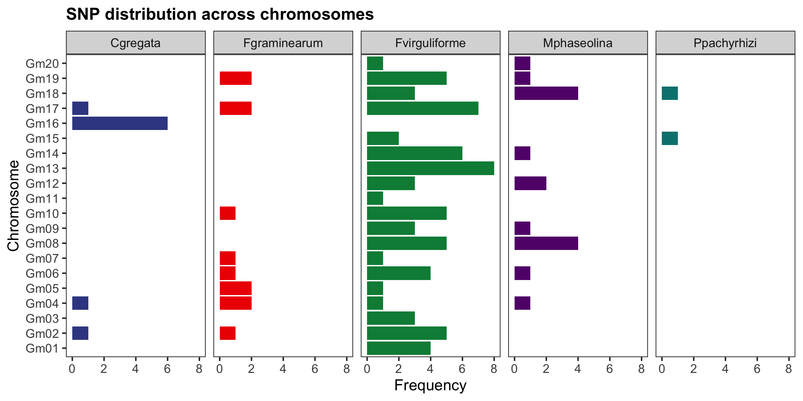
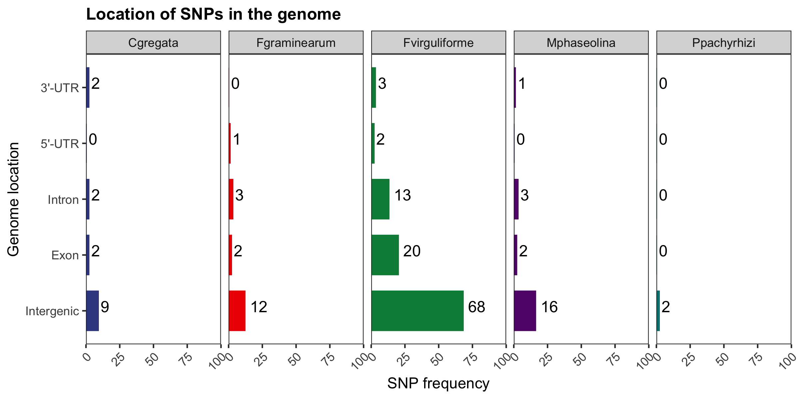
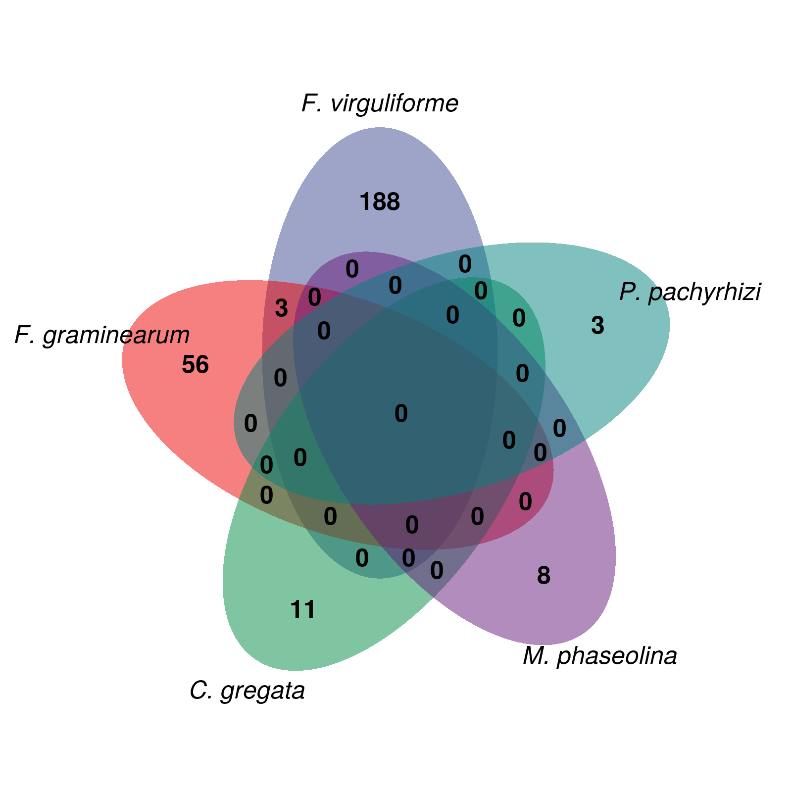

```{r setup, include=FALSE}
knitr::opts_chunk$set(
  warning = FALSE, 
  message = FALSE,
  echo = FALSE,
  fig.width = 7, fig.height = 2.5
)
options(htmltools.dir.version = TRUE)
```

```{r panels, echo=FALSE}
xaringanExtra::use_panelset()
```

background-image: url(figs/intro1.png)
background-position: 95% 50%
background-size: 45%

## Introduction

<br />

.pull-left[
Economy: 2% of our GDP .font80[(EMBRAPA, 2019)]

Billions of dollars spent each year in disease control .font80[(Osman et al., 2015)]
]

---

background-image: url(https://www.researchgate.net/profile/Martin-Heil-2/publication/258202582/figure/fig7/AS:271915302518812@1441841068064/Examples-of-common-fungal-diseases-of-plants-a-Rust-on-flax-Linum-usitatissimum-C_Q640.jpg)
background-position: 95% 50%
background-size: 45%

## Introduction

<br />

.pull-left[
Economy: 2% of our GDP .font80[(EMBRAPA, 2019)]

Billions of dollars spent each year in disease control .font80[(Osman et al., 2015)]

**Pathogenic fungi** -  Yield loss:

1. Leaf damage

2. Root rot

3. Seed damage

4. Death

2030 Agenda: sustainable increase in yield

.footnote[García-Guzmán *et al.*, 2013]

]

---

background-image: url(figs/intro3.png)
background-position: 50% 45%
background-size: 70%

## Soybean diseases

<br />

<br />

<br />

<br />

<br />

<br />

<br />

<br />

<br />

<br />

<br />

.center[Fungi and nematodes are responsible for the greatest yield losses in soybean.]

.footnote[Bandara *et al.*, 2020]

---

background-image: url(figs/intro4.png)
background-position: 95% 50%
background-size: 50%

## Plant immunity

<br />

.pull-left[

Arms race in plant defense:

- PAMP-triggered immunity (PTI)

- Effector-triggered immunity (ETI)

Several associated genes:

1. Recognition

2. Signal transduction

3. ROS production and oxidative burst

4. Defense-related proteins (e.g., PRs)

5. Physical barriers

.footnote[Song *et al.*, 2020]

]

---

background-image: url(figs/gwas_example1.png)
background-position: 50% 60%
background-size: 90%


## Genome-wide association studies (GWAS)

<br />

Identification of variants associated with a particular phenotype (*e.g.* disease resistance).

---

background-image: url(figs/gwas_example2.png)
background-position: 50% 60%

## Genome-wide association studies (GWAS)

<br />

Identification of variants associated with a particular phenotype (*e.g.* disease resistance).


---

background-image: url(figs/gwas_example3.png)
background-position: 50% 60%


## Genome-wide association studies (GWAS)

<br />

Identification of variants associated with a particular phenotype (*e.g.* disease resistance).

---

## The problem

<br />

GWAS have identified **causative SNPs** associated with resistance to fungal diseases, but not **causative genes**.

Existing methods lead to high false-positive and false-negative rates.

<br />

```{r}

```

**Problem:** too many false-negatives

---

## The problem

<br />

GWAS have identified **causative SNPs** associated with resistance to fungal diseases, but not **causative genes**.

Existing methods lead to high false-positive and false-negative rates.

<br />

```{r}

```

**Problem:** too many false-positives

---

## The possible solution

<br />

Vertices represent genes and edges represent the correlation coefficient among them.

```{r echo=FALSE, out.width='75%', fig.align='center'}

```

In large scale, one can detect **modules** of functionally-related genes.

---

## The possible solution

```{r echo=FALSE, fig.align='center'}
suppressPackageStartupMessages(library(networkD3))
data("MisLinks")
data("MisNodes")
MisNodes$group <- 1
MisNodes$group[MisNodes$name == "Valjean"] <- 2
MisNodes$name[MisNodes$name == "Valjean"] <- "Guide"
cols <- JS('d3.scaleOrdinal().domain(["1", "2"]).range(["steelblue", "maroon"])')

forceNetwork(Links = MisLinks, Nodes = MisNodes,
            Source = "source", Target = "target",
            Value = "value", NodeID = "name",
            Group = "group", colourScale = JS(cols),
            opacity = 0.9, height=600, width=1200)
```

---

## Goal

<br />
.center[.font120[Identify soybean resistance genes to common fungal diseases by integrating GWAS and coexpression networks]]

--

<br />
.font130[.brand-charcoal[.bold[Specific goals]]]

- Create a database of SNPs associated with resistance to fungal diseases in soybean

- Identify accessions in the USDA germplasm with the largest number of beneficial alleles

- Create a database of most promising genes associated with resistance to fungal diseases

- Identify the function of the mined candidates in plant immunity

---

background-image: url(figs/old_methods1.png)
background-size: cover

## Methods

---

background-image: url(figs/old_methods2.png)
background-size: cover

## Methods

---

background-image: url(figs/old_methods3.png)
background-size: cover

## Methods

---

background-image: url(figs/package_logos.png)
background-position: 95% 50%
background-size: 40%

## Software development


.pull-left[
.brand-charcoal[.font130[.bold[BioNERO:]]]

R package for:
- expression data preprocessing
- gene coexpression network inference
- functional analyses

<br/ >
.brand-charcoal[.font130[.bold[cageminer:]]]

R package for:
- integration of GWAS-derived SNPs with coexpression networks to mine candidate genes

]

---

background-image: url(figs/project_workflow.png)
background-size: 100%
background-position: 50% 30%

## Methods

---

background-image: url(figs/frequency_of_snps_and_transcriptome_samples_overlap.png)
background-position: 95% 50%
background-size: 45% 90%


## Data description

<br />

.pull-left[
.brand-charcoal[.font130[.bold[Filtering criterion:]]]

A species must be represented by:

- transcriptome samples

- significant SNPs
]

---

background-image: url(https://crop-protection-network.s3.amazonaws.com/articles/BSR-foliar-and-stem-symptoms-A.-sisson.jpg)
background-position: 95% 50%
background-size: 40%

## Data description

.pull-left[
5 common phytopathogenic fungi:

- *Cadophora gregata:* brown stem rot

.footnote[Fonte: Crop Protection Network]
]

---

background-image: url(https://bsppjournals.onlinelibrary.wiley.com/cms/asset/df052881-7bbb-4915-9a88-c4b74a28c9b4/ppa12532-fig-0001-m.jpg)
background-position: 95% 50%
background-size: 40%

## Data description

.pull-left[
5 common phytopathogenic fungi:

- *Cadophora gregata:* brown stem rot

- *Fusarium graminearum:* damping-off

.footnote[Chiotta *et al.*, 2016]
]

---

background-image: url(https://bugwoodcloud.org/images/768x512/5465755.jpg)
background-position: 95% 50%
background-size: 40%

## Data description

.pull-left[
5 common phytopathogenic fungi:

- *Cadophora gregata:* brown stem rot

- *Fusarium graminearum:* damping-off

- *Fusarium virguliforme:* sudden death syndrome

.footnote[Fonte: Daren Mueller]
]

---

background-image: url(https://phytus.s3.amazonaws.com/apps/clubephytus-api/midia/a/5fcdcbb8/thumbnail.jpg)
background-position: 95% 50%
background-size: 40%

## Data description

.pull-left[
5 common phytopathogenic fungi:

- *Cadophora gregata:* brown stem rot

- *Fusarium graminearum:* damping-off

- *Fusarium virguliforme:* sudden death syndrome

- *Macrophomina phaseolina:* charcoal rot

.footnote[Fonte: Elevagro]
]

---

background-image: url(https://www.agrolink.com.br/upload/problemas/Phakopsora_pachyrhizi57.jpg)
background-position: 95% 50%
background-size: 40%

## Data description

.pull-left[
5 common phytopathogenic fungi:

- *Cadophora gregata:* brown stem rot

- *Fusarium graminearum:* damping-off

- *Fusarium virguliforme:* sudden death syndrome

- *Macrophomina phaseolina:* charcoal rot

- *Phakopsora pachyrhizi:* asian rust

.footnote[Fonte: Agrolink]
]

---

background-image: url(figs/snp_circos.png)
background-position: 95% 95%
background-size: 55% 95%

## Data description

<br />

.pull-left-1[
SNPs are located in gene-rich regions.
]

---

## Data description

```{r fig1_snp_dist, out.width='900px', out.height='500px', fig.align='center'}

```

Overall bias towards particular chromosomes.

---

## Data description

```{r fig1_snp_pos, out.width='900px', out.height='450px', fig.align='center'}

```

Most SNPs in intergenic regions.

---

## Candidate gene selection

<br />

```{r all_cand, out.width='900px', out.height='500px', fig.align='center'}

```

---

## Candidate gene prioritization

```{r workflow_cageminer, echo=FALSE}
knitr::include_graphics("figs/workflow.png")
```

---

## Candidate gene prioritization

.pull-left[

<br />

- *Cadophora gregata:* **11** 

- *Fusarium graminearum:* **59** 

- *Fusarium virguliforme:* **191** 

- *Macrophomina phaseolina:* **8** 

- *Phakopsora pachyrhizi:* **3** 

Highly **species-specific** defense

]

.pull-right[
```{r venn, echo=FALSE}

```
]

---

## Selection of most promising genes

<br />
Assignment of *scores* to prioritized genes:

.font140[
$$S_i = r_{pb} \kappa$$
] 

.center[
where:

$\kappa$ = 2 if the gene is a transcription factor

$\kappa$ = 2 if the gene is a hub (highly connected)

$\kappa$ = 3 if the gene is a hub transcription factor

]

---

## Selection of most promising genes

```{r genes_promissores_tabela}
gene_role <- readr::read_csv(
  "data/top_candidates_and_role.csv"
)
```

.panelset[
.panel[.panel-name[C. gregata]
```{r cgregata_genetable}
suppressPackageStartupMessages(library(formattable))
cgregata <- gene_role[gene_role$`Resistance to` == "C. gregata", -3]
formattable(cgregata, align=c('l', 'l', 'l'))
```
]
.panel[.panel-name[F. graminearum]
```{r fgraminearum_genetable}
fgraminearum <- gene_role[gene_role$`Resistance to` == "F. graminearum", -3]
formattable(fgraminearum, align=c('l', 'l', 'l'))
```
]
.panel[.panel-name[F. virguliforme]
```{r fvirguliforme_genetable}
fvirguliforme <- gene_role[gene_role$`Resistance to` == "F. virguliforme", -3]
formattable(fvirguliforme, align=c('l', 'l', 'l'))
```
]
.panel[.panel-name[M. phaseolina]
```{r mphaseolina_genetable}
mphaseolina <- gene_role[gene_role$`Resistance to` == "M. phaseolina", -3]
formattable(mphaseolina, align=c('l', 'l', 'l'))
```
]
.panel[.panel-name[P. pachyrhizi]
```{r ppachyrhizi_genetable}
ppachyrhizi <- gene_role[gene_role$`Resistance to` == "P. pachyrhizi", -3]
formattable(ppachyrhizi, align=c('l', 'l', 'l'))
```
]
]

---

background-image: url(figs/biorender_figure.png)
background-size: 85% 85%
background-position: 50% 90%

.center[
.red[*C. gregata*] &nbsp;&nbsp;&nbsp;&nbsp;&nbsp;
.blue[*F. graminearum*] &nbsp;&nbsp;&nbsp;&nbsp;&nbsp;
.brown[*F. virguliforme*] &nbsp;&nbsp;&nbsp;&nbsp;&nbsp;
.green[*M. phaseolina*] &nbsp;&nbsp;&nbsp;&nbsp;&nbsp;
.purple[*P. pachyrhizi*]
]

---

## PAV in the soybean pangenome

Overall, genes are present in all 205 soybean genomes.

```{r pav, out.width='75%'}
suppressPackageStartupMessages(library(ggiraph))
suppressPackageStartupMessages(library(tidyverse))
load(here::here("data", "pav_pangenome_table.rda"))
colnames(freq_table)[1] <- "Gene"
pav_plot_int <- freq_table %>%
    arrange(Species, -Mean) %>%
    mutate(index=1:nrow(freq_table)) %>%
    ggplot(., aes(x=index, y=Mean)) +
    geom_point_interactive(aes(tooltip=Gene, color=Species), size=1) +
    ggsci::scale_color_aaas() +
    theme_classic() +
    labs(title="PAV of mined candidate genes in the soybean pangenome",
         x="Gene index", y="Relative frequency") +
    theme(legend.position="bottom")
girafe(code = print(pav_plot_int), height_svg = 4, width_svg = 8)
```

---

## PAV in the soybean pangenome

```{r pangenome_paper1, fig.align='center', out.width='75%'}

```

```{r pangenome_paper2, fig.align='center', out.width='75%'}

```

---

## Selection of best accessions

<br />

**Objective:** largest number of beneficial alleles and smallest number of deleterious alleles.

--

.pull-left[
.blue[.bold[A &rarr; G]] 👍🏼  

GG = 2

AG = 1

AA = 0

]

--

.pull-right[

.red[.bold[A &rarr; G]] 👎🏻  

GG = 0

AG = 1

AA = 2 

]

---

## Selection of best accessions

<br />

```{r cultivares, echo=FALSE, warning=FALSE, eval=FALSE}
suppressPackageStartupMessages(library(formattable))
acc <- read.csv("data/best_accessions_and_potential.txt", sep="\t")
acc2 <- acc[, c(4,1,3,2)]
acc2$Potential <- round(acc2$Potential, 2)
acc2$Score <- round(acc2$Score, 2)
formattable(acc2, 
            align = c("l", "l", "r", "r"),
            list(
              Potential = color_bar("lightblue")
              )
            )
``` 

.pull-left[
``` {r echo=FALSE, fig.align='right'}

```
]

.pull-right[
``` {r echo=FALSE, fig.align='left'}

```

]

There is still room to pyramid resistance alleles with MAS or genome editing.

---

background-image: url(http://www.mcgilltribune.com/wp-content/uploads/2019/11/gene_editing.jpg)
background-position: 95% 50%
background-size: 40%

## Conclusion

.pull-left[
We have identified promising candidate genes that can be used to develop soybean lines resistant to 5 common phytopathogenic fungi through:

- Genome editing

- Transformation

.footnote[Fonte: The McGill Tribune]

]

---

background-image: url(https://www.agroscope.admin.ch/agroscope/en/home/topics/plant-production/plant-breeding/ackerpflanzen/selection_soja/_jcr_content/par/columncontrols/items/1/column/image/image.imagespooler.jpg/1473888418017/selection_soja_fleur.jpg)
background-position: 95% 50%
background-size: 40%

## Conclusion

.pull-left[
We have identified promising candidate genes that can be used to develop soybean lines resistant to 5 common phytopathogenic fungi through:

- Genome editing

- Transformation

We have identified the most resistant accessions in the USDA germplasm:

- Parents in breeding programs

- Edited with CRISPR-Cas to insert the remaining alleles

.footnote[Fonte: Agroscope]
]

---

background-image: url(figs/package_logos.png)
background-position: 95% 50%
background-size: 40%

## Conclusion

.pull-left[
We have identified promising candidate genes that can be used to develop soybean lines resistant to 5 common phytopathogenic fungi through:

- Genome editing

- Transformation

We have identified the most resistant accessions in the USDA germplasm:

- Parents in breeding programs

- Edited with CRISPR-Cas to insert the remaining alleles.

We have developed 2 products (R packages) that can be used to mine candidates for other traits.
]

---

class: sydney-yellow, middle, center

## Here's where you can find me:

`r icons::fontawesome("twitter")`  [@almeidasilvaf](https://twitter.com/almeidasilvaf)

`r icons::fontawesome("github")`  [almeidasilvaf](https://github.com/almeidasilvaf/)

`r icons::fontawesome("globe")`  [almeidasilvaf.github.io/home](https://almeidasilvaf.github.io/home/)

`r icons::fontawesome("envelope")`  [fabricio_almeidasilva@hotmail.com](mailto:fabricio_almeidasilva@hotmail.com)

`r icons::academicons("orcid")`  [Fabricio Almeida-Silva](https://orcid.org/0000-0002-5314-2964)
